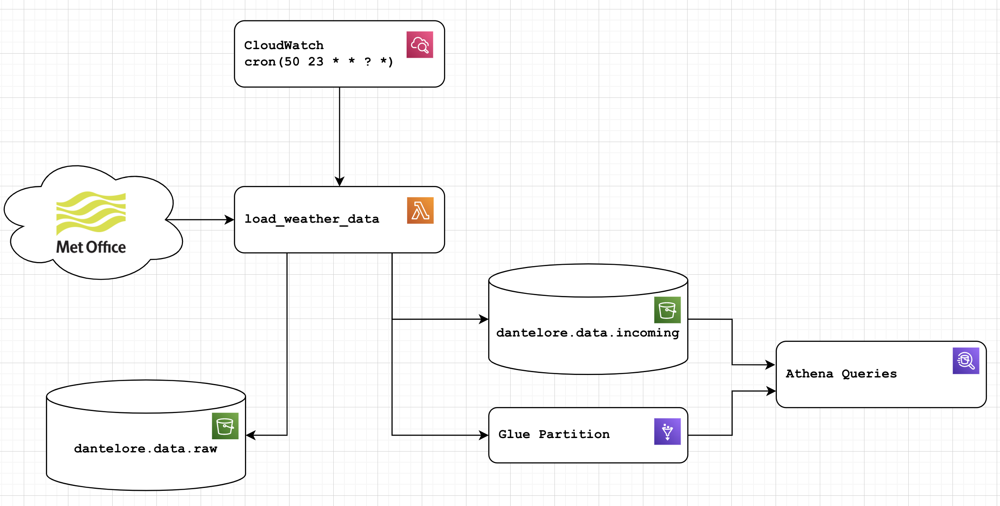

# Weather Data Demo

This project contains an example implementation of a basic but functional AWS data architecture.  
Loading data from a variety of data sources, processing that data into a usable data lake etc.

*  <strong>datahub_etl</strong> is a simple AWS Lambda function to load weather data from the UK Met Office's DataHub Observations API.
*  <strong>datapoint_etl</strong> the old ETL which pulls from the now deprecated datapoint API.
*  <strong>ceda_bulk_data</strong> is a script to import data from the CEDA historical weather data API.
*  <strong>terraform</strong> contains all the config to create all the required infra in AWS
*  <strong>notebooks</strong> some notebooks with data quality views based on the data
*  <strong>weather_data_model</strong> a lambda function to model data from "raw incoming" to a clean, deduplicated dataset which could be used for analysis and product development

# Weather Data ETL

A simple implementation of a working ETL in AWS.  Pulls data from the Met Office [DataHub Observations](https://datahub.metoffice.gov.uk/docs/g/category/observations/overview) API.  It previously used the, now deprecated,
[DataPoint API](https://www.metoffice.gov.uk/services/data/datapoint) API, 
both of which provide observation data in real time.

Data is currently pulled by a Python ETL, within a Lambda function, triggered just 
before midnight each night.  Output is pushed to S3 in a more queryable JSON format.
The lambda function also saves the raw input to a separate S3 bucket for replay and to deal with errors.
Finally, once data is loaded to the _incoming_ bucket, the function will update the relevant glue partition, 
ensuring data is queryable as soon as it is added.



This simple ETL gets you as far as usable data in S3/Athena. It's the first step to building a data platform in AWS.
Using this raw incoming data comes with risks though - you're likely to see duplicates, missing fields and perhaps even 
schema changes over time.

The data is (deliberately) stored with a schema matching the domain from which it came: in this case the schema of the 
weather data is quite Met Office specific. If we wanted to pull in data from other sources 
([Meteo](https://meteofrance.com/) or the [WMO](https://public.wmo.int/en) for example), different ETLs and different 
schemas would be used. A downstream job could then be written to munge all these different sources into a single 
consistent model of weather data worldwide - but this shouldn't be done in the ETL layer as it adds complex dependencies 
and business logic we don't want or need.

## DataHub update

The move from the Datapoint to DataHub API has led to a few issues and changes:

The original API allowed users to list sites and pull observations for each - allowing us to build a complete view of the UK.  The new API does not provide any site list functionality, instead allowing the client to pass a location (lat/lon) and returning a list of 1 to 5 nearest weather stations.  To get around this, we use the lat and lon locations for the weather stations we know about (see `sites.json`) to "seed" the location lookups - allowing the dataset to continue unchanged.

There is a gap in the data over January 2026 as I did not get chance to fix the code before then.  I will come back to fix that from another source one day!

The new DataHub API returns 48 hours of data for each run. We download every 24 hours, so we expect duplicates in the data. This actaully works well with our strategy of deduplicating as the data moves from `incoming` to `lake` - at the cost of a little extra storage, we get simple and robust handling for missing and late data (e.g. if something goes wrong, the data is fetched again at least once).

### Files of Interest
* **weather_etl** the code that does the extract/transform of the data
* **main.py** run it locally
* **lambda_function.py** the lambda function implementation 
* **aws_helpers.py** Some AWS helper functions for Athena, Glue, S3 etc
* **tests/** Unit tests and test data
* **terraform/lambda_function.tf** terraform to create the lambda, roles, trigger etc
* **terraform/glue.tf** setup for the glue table, including schema, partitioning etc


## Thoughts and Things to Do

* How to deal with failures - what happens if the job fails - only 24h of data is available on the API, so failure would mean data loss.  How to deal with this IRL?
* How would we deal with changing schemas?
* In real life, it might make sense to look at Airflow rather than a lambda function to manage this job.  However, I can't afford to operate an Airflow setup on my personal AWS account!
* You might well want to operate a real time data platform ([like this](https://dantelore.com/posts/kafkas-beer-festival/)) as well as just a Data Lake - in which case, this ETL should post to a REST API, which acts as a facade in front of your RTP and Data Lake.
* The glue schema here is managed directly by Terraform, meaning it is explicitly set and linked (via git) to a specific version of the ETL. Glue Crawlers promise to do this automatically, but beware! Glue Crawlers aren't great at detecting data types - and having an explicit schema with an obvious way to manage change is very valuable.

### Met Office API Key

It's a secret!  So, create a file called `api_key.py` containing:
```
API_KEY = "12345678-ABCD-1234-ABCD-123456789ABC"
```

### Schema Validation

It makes a lot of sense to validate data written to the _Incoming_ bucket against a JSON schema.  This
is basically an implementation of [schema on write](https://luminousmen.com/post/schema-on-read-vs-schema-on-write), 
where you validate data before you write it to the lake, rather than worrying about it every time you query.

I wrote a function to do this, but it's pretty slow, and since I am paying for this with my own money, not 
worth it for this demo - so I left it out of the Lambda function itself.  In a real system, it may well make sense
to do this - either within the ETL, the ETL framework or a separate component in the architecture/flow.

```python
def validate_json(data_filename, schema_filename):
    with open(schema_filename, 'r') as schema_file:
        schema = json.load(schema_file)

    with open(data_filename, 'r') as data_file:
        for line in data_file:
            obj = json.loads(line)

            jsonschema.validate(obj, schema)
```

Other formats for data storage like Avro and Parquet will enforce a schema themselves, giving you schema-on-write for free.
Hard coding the glue schema, as we have done here (see `glue.tf`) also helps.
