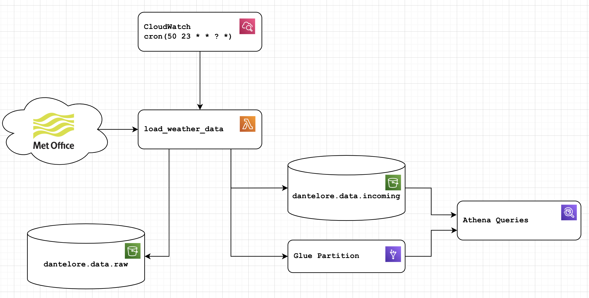

# Weather ETL

A simple implementation of a working ETL in AWS.  Pulls data from the Met Office
[DataPoint API](https://www.metoffice.gov.uk/services/data/datapoint) API, 
which provides 24 hourly weather observations in real-ish time.

Data is currently pulled by a Python ETL, within a Lambda function, triggered just 
before midnight each night.  Output is pushed to S3 in a more queryable JSON format.
The lambda function also saves the raw input to a separate S3 bucket for replay and to deal with errors.
Finally, once data is loaded to the _incoming_ bucket, the function will update the relevant glue partition, 
ensuring data is queryable as soon as it is added.



This simple ETL gets you as far as usable data in S3/Athena. It's the first step to building a data platform in AWS.
Using this raw incoming data comes with risks though - you're likely to see duplicates, missing fields and perhaps even 
schema changes over time.

The data is (deliberately) stored with a schema matching the domain from which it came: in this case the schema of the 
weather data is quite Met Office specific. If we wanted to pull in data from other sources 
([Meteo](https://meteofrance.com/) or the [WMO](https://public.wmo.int/en) for example), different ETLs and different 
schemas would be used. A downstream job could then be written to munge all these different sources into a single 
consistent model of weather data worldwide - but this shouldn't be done in the ETL layer as it adds complex dependencies 
and business logic we don't want or need.

### Files of Interest
* **weather_etl** the code that does the extract/transform of the data
* **main.py** run it locally
* **lambda_function.py** the lambda function implementation 
* **aws_helpers.py** Some AWS helper functions for Athena, Glue, S3 etc
* **tests/** Unit tests and test data
* **terraform/lambda_function.tf** terraform to create the lambda, roles, trigger etc
* **terraform/glue.tf** setup for the glue table, including schema, partitioning etc


## Thoughts and Things to Do

* How to deal with failures - what happens if the job fails - only 24h of data is available on the API, so failure would mean data loss.  How to deal with this IRL?
* Schema-on-write validation
* How would we deal with changing schemas?
* In real life, it might make sense to look at Airflow rather than a lambda function to manage this job.  However, I can't afford to operate an Airflow setup on my personal AWS account!
* You might well want to operate a real time data platform ([like this](https://dantelore.com/posts/kafkas-beer-festival/)) as well as just a Data Lake - in which case, this ETL should post to a REST API, which acts as a facade in front of your RTP and Data Lake.
* The glue schema here is managed directly by Terraform, meaning it is explicitly set and linked (via git) to a specific version of the ETL. Glue Crawlers promise to do this automatically, but beware! Glue Crawlers aren't great at detecting data types - and having an explicit schema with an obvious way to manage change is very valuable.

### Met Office API Key

It's a secret!  So, create a file called `api_key.py` containing:
```
API_KEY = "12345678-ABCD-1234-ABCD-123456789ABC"
```