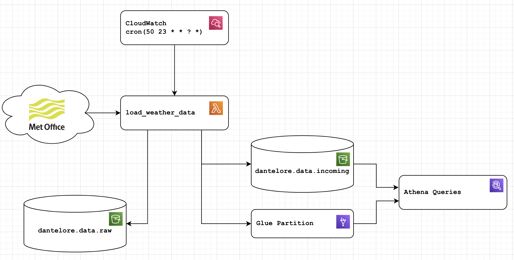

# Weather ETL

ETL pipeline that extracts hourly weather observations from the UK Met Office DataHub API, transforms them, and loads them into an AWS data lake queryable via Athena.

For the thinking behind the design choices see: [World's Simplest Data Pipeline](https://dantelore.com/posts/simplest-data-pipeline/) and [Data Modeling Approach](https://dantelore.com/posts/simplest-data-model/).

## Architecture



Data flows left to right through two stages:

**Extract → incoming (raw)**
The `load_weather_data` Lambda runs every hour. It calls the Met Office DataHub API for each of the 137 known stations and writes the raw observations as NDJSON to `s3://dantelore.data.incoming/weather/`, queryable via `incoming.weather` in Athena. The API returns 48 hours of history per call, so a missed run does not cause a gap.

**Transform → lake (modelled)**
The `model_weather_data` Lambda runs every night at 06:00 UTC. It reads all of `incoming.weather`, deduplicates using a window function keyed on `(hour, site_id)`, filters out known bad data, and writes clean Parquet to `s3://dantelore.data.lake/weather/` as `lake.weather`. A monthly summary table (`lake.weather_monthly_site_summary`) is built in the same run.

The full rebuild approach means any fix to processing logic propagates across the entire history on the next nightly run, with no need for backfill jobs.

## Repo structure

| Folder | Description |
|---|---|
| `datahub_etl/` | `load_weather_data` Lambda — extract and load to incoming |
| `weather_data_model/` | `model_weather_data` Lambda — nightly rebuild of lake tables |
| `helpers/` | Shared AWS/boto3 helpers (all boto3 calls go through here) |
| `terraform/` | All AWS infrastructure as code |
| `catalogue/` | Data catalogue — dataset descriptions, schemas, caveats |
| `notebooks/` | Data quality and exploration notebooks |
| `ceda_bulk_data/` | One-off bulk load script for CEDA MIDAS historic data (deprecated) |
| `datapoint_etl/` | Legacy ETL for the old DataPoint API (deprecated, no longer active) |

## Data catalogue

Dataset documentation lives in [`catalogue/weather-etl/`](catalogue/weather-etl/README.md). This is part of a shared data catalogue brought in via git subtree — the weather-etl project owns and edits the `weather-etl/` entries, which are pushed back to the central catalogue repo.

The catalogue covers:
- Exact table names, S3 paths, formats, and partition schemes
- Field specs with types and nullability taken from the Terraform Glue definitions
- Update cadence and freshness for each table
- Known issues and data quality caveats

**If you want to query the data, start there.** The catalogue is the ground truth for what exists, where it is, and what the gotchas are.

To push catalogue changes back to the central repo:
```bash
git subtree push --prefix=catalogue catalogue main
```

To pull in changes from the central repo:
```bash
git subtree pull --prefix=catalogue catalogue main --squash
```

## Getting started

### API key

Create `api_key.py` in the repo root (git-ignored):
```python
API_KEY = "your-key-here"
```
Register at https://datahub.metoffice.gov.uk/ for a free tier key.

### Running tests
```bash
pytest tests/ -v
```

### Deploying
```bash
bash build.sh
```
Packages the Lambda functions, uploads `sites.json` to S3, and runs `terraform apply`.

## Notes

- There is a gap in `incoming.weather` over January 2026 due to a DataHub API migration issue. The data is absent from S3 and cannot be recovered from the API.
- The CEDA MIDAS historic data (`incoming.midas`) covers 1875–2020 and is a frozen snapshot. It will not be updated. See the catalogue entry for query gotchas.
- The `datapoint_etl/` folder contains the legacy DataPoint API code. It is inactive; all current writes use `datahub_etl/`.
